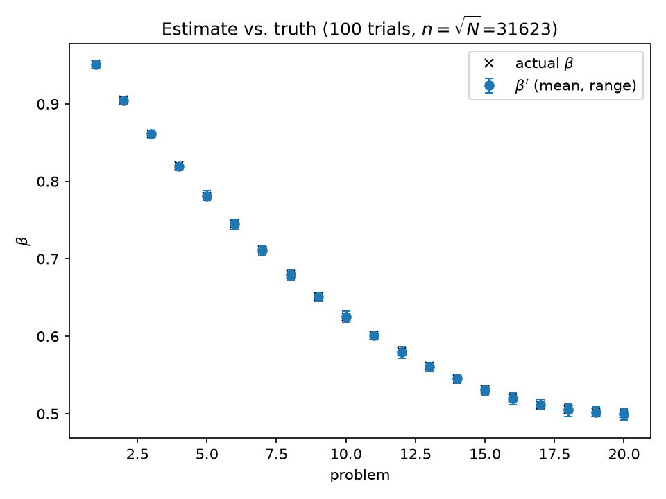
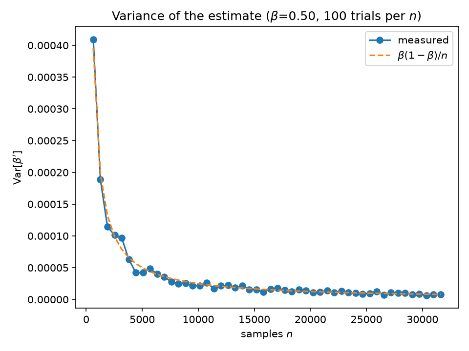
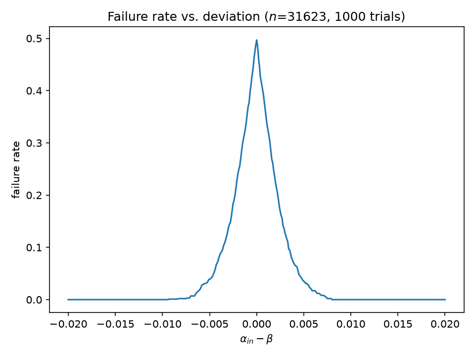
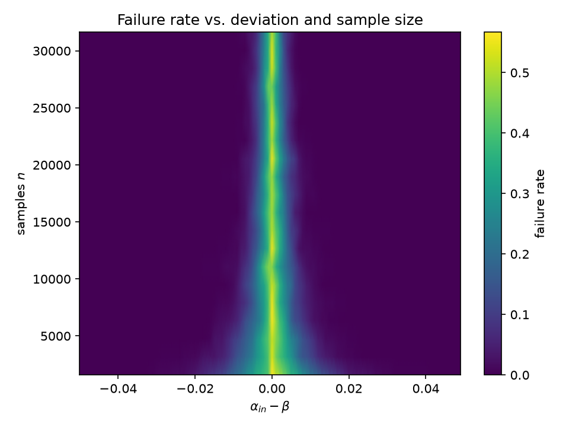
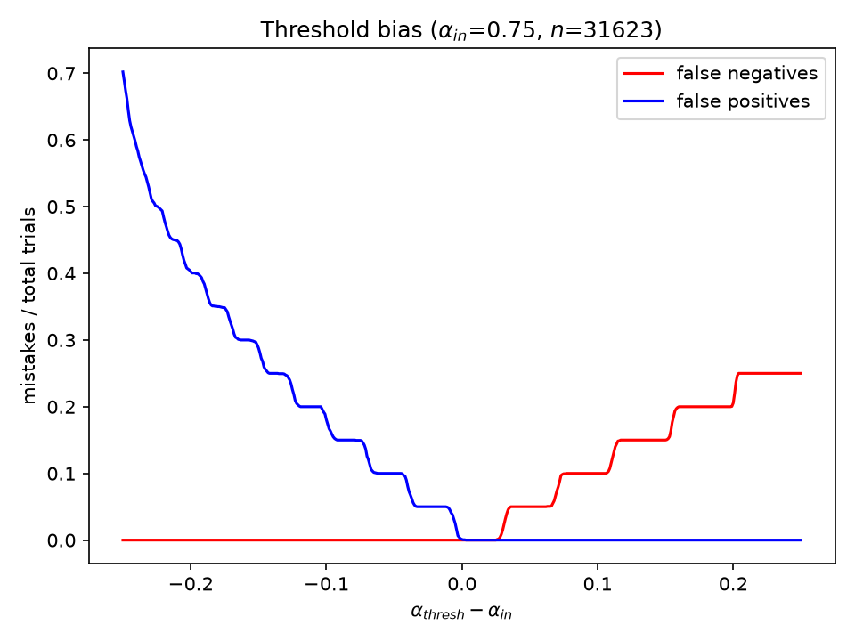

# Randomized approximate-sortedness testing

Python port of an old MATLAB course project for Randomized Algorithms back in 2019 with minimal bits of discussion extracted from my full report.

## The problem

Given a list `L` of `N` integers and a threshold `alpha`, decide whether `L` is
**alpha-approximately-sorted**. Sortedness is measured with the
*beta-pairwise* metric:

$$\beta = \frac{|C|}{|P|}, \quad P=\\{(e_i,e_j) \mid i\lt j \\}, \quad C=\\{(e_i,e_j)\in P\mid e_i\le e_j\\}$$

Computing `beta` exactly costs `O(N^2)` pair comparisons (or `O(N log N)` by
inversion counting). The randomized algorithm avoids that entirely.

## The algorithm

Sample `n` index pairs uniformly at random with replacement, count how many are
in order, and report `beta' = (#in order)/n`. Answer YES iff `beta' >= alpha`.
Cost is `O(n)`, independent of `N`.

With `X_i = 1[pair i is ordered]`:

- **Expectation** — `Pr[X_i = 1] = beta`, so `E[beta'] = beta`. Unbiased.
- **Variance** — the `X_i` are independent, so `Var[beta'] = beta(1-beta)/n <= 1/(4n)`.
- **Concentration** — Chernoff/Hoeffding gives `Pr[|beta' - beta| > t] <= 2 e^{-2nt^2}`.
  Inverting: `n = ln(2/delta)/(2t^2)` and `t = sqrt(ln(2/delta)/(2n))`. For
  `t = delta = 0.01` that is `n ≈ 26,492` samples — for *any* list length.

The only failure mode is `alpha` sitting within sampling noise of `beta`; when
`alpha == beta` the answer is a coin flip by construction. Shifting the
decision threshold away from `alpha` trades false negatives for false
positives (see `threshold`).

## Test problems

Benchmark lists are rotations of `[1..N]`: pick a split `s`, emit
`[s+1..N] + [1..s]`. The only out-of-order pairs are the `s(N-s)` straddling
ones, so

$$\beta = 1 - \frac{s(N-s)}{N(N-1)/2}$$

is known in closed form. `Problem` stores the rotation implicitly and computes
elements on demand (`Problem.at`), so `N = 10^9` lists cost no memory — the
MATLAB original had to save gigabyte `.mat` files under `Data/`.
`Problem.to_array()` materializes small lists, and `exact_beta` gives ground
truth for arbitrary lists via merge-sort inversion counting.

## Layout

| file | contents |
| --- | --- |
| `src/approxsort/core.py` | `Problem`, `approx_beta`, `is_approximately_sorted`, `exact_beta`, Chernoff helpers |
| `src/approxsort/experiments.py` | all five experiments + CLI |

The MATLAB `vectorApproxBeta.m` / `forLoopApproxBeta.m` / `ApproximateBeta.m` /
`testingSpeedup.m` collapse into one vectorized `approx_beta`;
`genApproxSortedArray.m` + `GenProb.m` + `GenBulkProb.m` collapse into
`Problem` / `problem_with_beta`.

## Running

```bash
uv sync
uv run approxsort all        # ~5 s, writes results/
uv run approxsort variance   # or a single experiment
uv run approxsort --seed 7 failure
```

Experiments (20 problems with `beta` from 0.95 to 0.50, `N = 10^9`,
`n = sqrt(N) ≈ 31,623` unless swept):

- `expectation` — actual `beta` vs. mean/min/max of 100 estimates per problem.
  → `expectation.csv`, `expectation.png`
- `variance` — variance of `beta'` over 50 sample sizes, against `beta(1-beta)/n`.
  → `variance.csv`, `variance.png`
- `failure` — failure rate vs. `alpha_in - beta` on the `beta = 0.5` problem.
  → `failure_rate.csv`, `failure_rate.png`
- `errors` — same failure envelope as a heatmap over deviation × sample size.
  → `errors_vs_samples.png`
- `threshold` — false negative / false positive rates as the decision
  threshold moves away from `alpha_in = 0.75`. → `threshold.csv`, `threshold.png`
- `bounds` — prints the Chernoff numbers quoted above.

## Results

Figures below are from `uv run approxsort all --seed 0`; rerunning regenerates
them in `results/`.

**Estimates are unbiased.** Across all 20 problems the mean of 100 estimates
sits on the true `beta` (max deviation `3e-4`), and the min/max whiskers stay
within about `±0.008` — roughly `3 sigma` for `n = 31,623`. Note this costs
31,623 comparisons on a billion-element list.



**Variance follows the analysis.** Measured variance over 50 sample sizes lands
on `beta(1-beta)/n` with no visible bias; at `n = 10,000` it is already `~2.5e-5`
(std `~0.005`). Neither curve depends on `N`.



**Failure is confined to a narrow band around `beta`.** On the `beta = 0.5`
problem the failure rate is exactly 50% when `alpha_in = beta` (the estimate is
centered there, so the comparison is a coin flip) and drops to zero once
`|alpha_in - beta| > ~0.01` — consistent with the Chernoff `t = 0.0163` at
`delta = 0.01`.



Sweeping `n` shows the band pinching in as `1/sqrt(n)`: the decision is
unreliable only when the caller's threshold is within sampling noise of the
truth, and more samples shrink exactly that window.



**Failures can be biased to one type.** Comparing against a shifted threshold
`alpha_thresh` instead of `alpha_in = 0.75` drives one error type to zero:
lowering it eliminates false negatives (at the cost of false positives on
problems whose `beta` is just under 0.75), raising it does the reverse. The
staircase is the 20 discrete problem `beta`s entering/leaving the wrong side of
the threshold.



## Other sortedness metrics (from the report's appendix, not implemented)

- **alpha-neighbor** — fraction of *adjacent* pairs in order; high values mean
  the list splits into few sorted runs. Samples the same way.
- **alpha-anomaly** — longest sorted subsequence over `N`; i.e. how few
  elements you would have to delete. Deterministically a DP problem.
- **alpha-swap** — fraction of elements already at their final position.
  Intuitive but brittle: `[10,1,...,9]` scores 0.1 while `[10,2,...,9,1]`
  scores 0.8, which is backwards to a human eye.

`beta`-pairwise was chosen because it counts both *which* elements are out of
order and *how far*.
